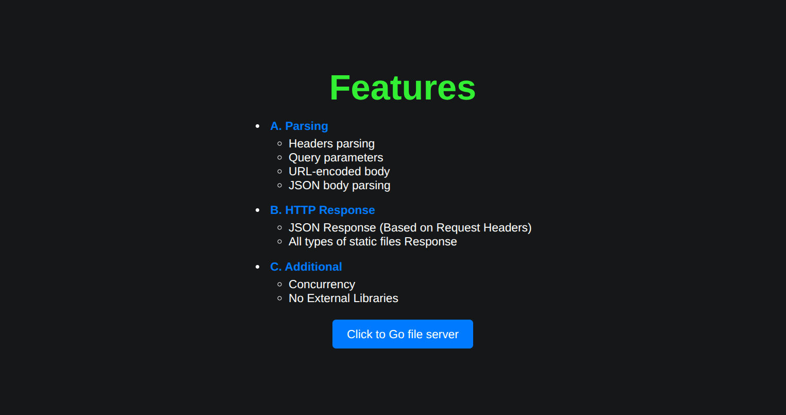
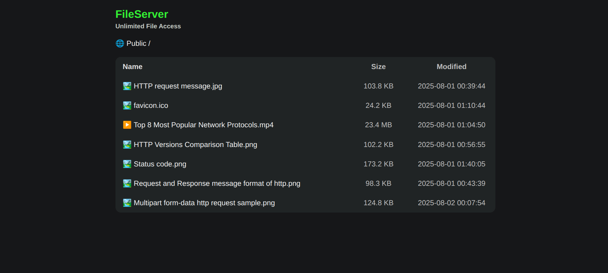
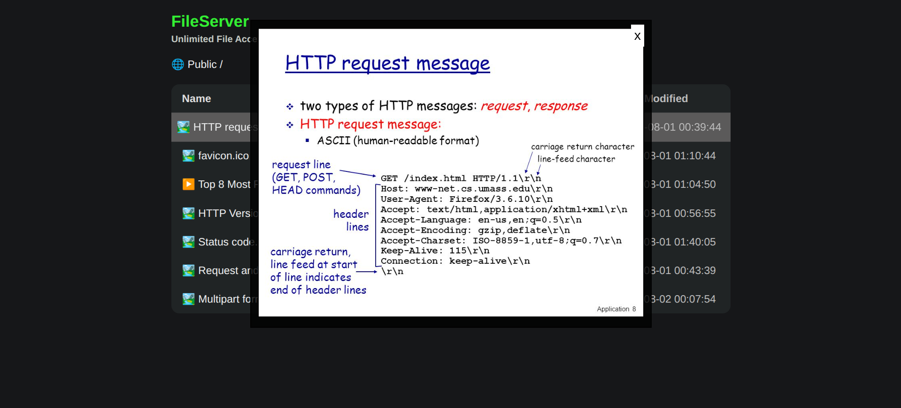
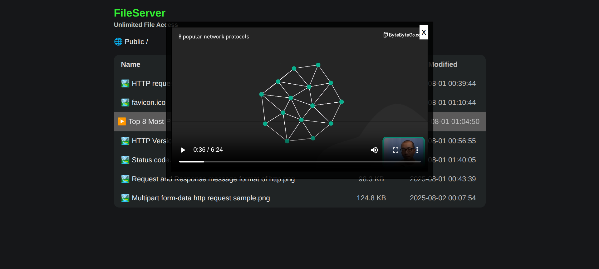

# DIY HTTP Server (No External Libraries)
A simple, educational HTTP server built using Python's socket module only — no frameworks, no dependencies.
This project demonstrates how basic HTTP parsing, routing, static file serving, and response generation work under the hood.


## Feature list
| Category            | Features                                                                          |
| ------------------- | --------------------------------------------------------------------------------- |
| **Request Parsing** | ✅ Header Parsing<br>✅ JSON Body <br>✅ Query Parameters<br>✅ URL-encoded Body  |
| **HTTP Response**   | ✅ JSON Response Based on Request Headers<br>✅ Static Files Response (any type)  |
| **Additional**      | ✅ Concurrency (threading)<br>✅ No External Libraries<br>✅ Built-in File Server UI |


## ⚙️ Setup
python version: `>= 3.5`

1. Clone the repository.
   ```
   git clone https://github.com/reju-1/diy-http-server.git
   cd diy-http-server
   ```
2. Run the server:
   ```bash
   python src/server.py
   ```
Now visit the server at: `http://localhost:8080`


## UI Overview

### Home page `/`
Showcases the supported features with minimal styling and clean layout.


### Public File Server `/public.html`
Serves all static files inside the /public directory. Clicking on files auto-previews them. 


   - **Image Preview:** Click on image files to preview in-browser. 
   - **Video Streaming:** Click video files to stream directly in the browser. 
